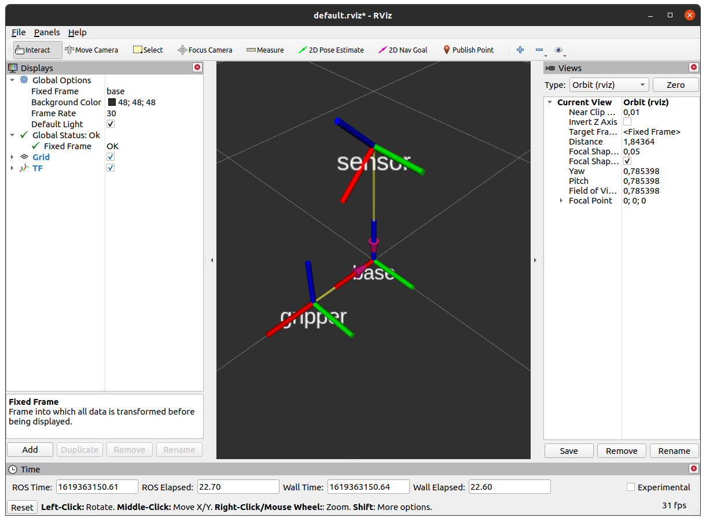
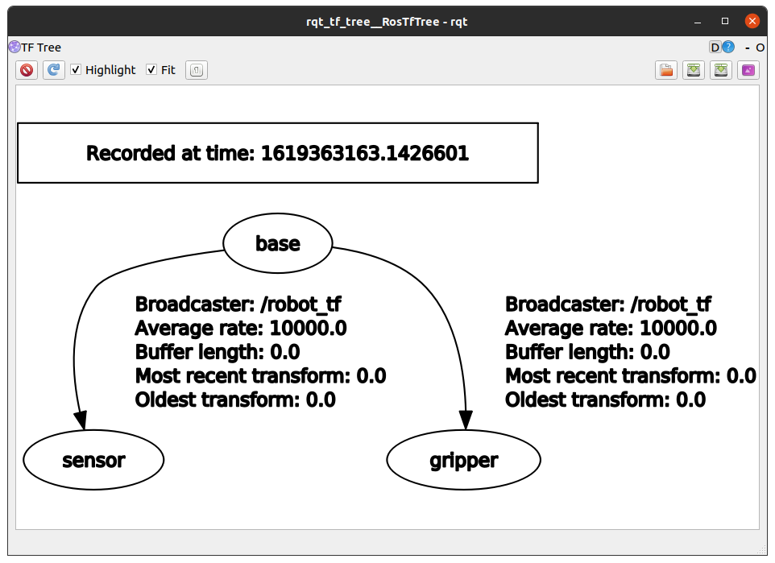

# Blatt 1

## Aufgabe 3

### Teil C

- *Decay Time* lässt die verschiedenen Scans mit `odom_combined` als Grundriss erscheinen
- es lässt sich ein Gebäudegrundriss erkennen (`odom_combined`)
- das Frame `base_link` ist weiterhin unverständlich - vermutlich die Sichtweise des Roboters

## Aufgabe 4

### Teil A

> lassen sich die vorhandenen Topics anzeigen?

Mittels `rosbag info <path>` können unter anderem die Topics angezeigt werden.

> lassen sich die Messages eines Topics auf die Kommandozeile schreiben?

BAG-Datei ausführen und mittels `rostopic echo <topic>` ausgeben lassen (bspw. `rostopic echo /imu`).

> lässt sich die Publizierungs-Rate eines Topics ermitteln?

`rostopic hz <topic>`

> lässt sich der Message Typ eines Topics ermitteln?

`rostopic type <topic>`

### Nr C

> warum sich der Algorithmus für die vorliegende Fragestellung eher eignet als die klassische Be- rechnung des Mittelwerts und der Varianz.

Der vorliegende Algorithmus muss nicht alle Werte in einer Liste speichern und verwendet ein Näherungsverfahren, sodass Speicherplatz eingespart wird. Normalerweise müssen für die Berechnung des Mittelwerts alle Werte zwischengespeichert werden.

> warum in dieser rekursiven Formel X̄1 und V1 berechnet werden kann, ohne dass Sie X̄0 und V0 kennen.

Die Formel beschreibt ein Näherungsverfahren, sodass von einem beliebig ungenauen Startpunkt ausgegangen werden kann. Das Ergebnis wird mit der Zeit (mehrere Iterationen) genauer.

## Aufgabe 5

### Teil A

### Teil B

> Erklären Sie, inwiefern sich geometry msgs/PointStamped von geometry msgs/Point unterscheidet und wie dies mit dem TF-System zusammenhängt.

`PointStamped` enthält zusätzlich TF-Informationen über das Bezugssystem, um Transformationen automatisch zu erlauben. `Point` definiert stattdessen nur drei Werte (Punke).

